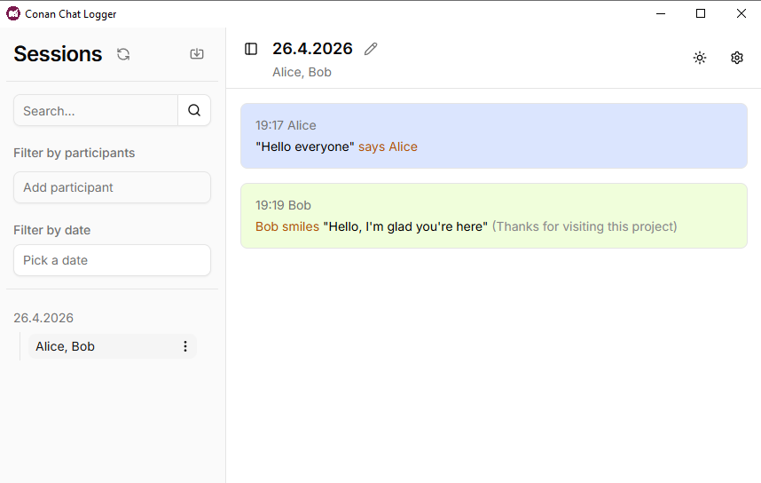

# Conan Chat Logger

The Conan Chat Logger is a tool for logging Conan chats, with built-in features to view and manage your sessions.

## Installation

Or download from [Releases](https://github.com/ivrenOak/conan-chat-logger/releases) the conan-chat-logger.setup.exe and run it.

## Updating

You can just install the app again. The app includes an autoupdater.

## Bug reports

Have you found a bug? Please report it in the issues tab.

Do you have questions? Join my [Discord](https://discord.gg/qUaaUK3v) and feel free to ask.
