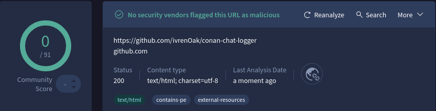

# Conan Chat Logger

The Conan Chat Logger is a tool for logging Conan chats, with built-in features to view and manage your sessions.

## Installation

Or download from [Releases](https://github.com/ivrenOak/conan-chat-logger/releases/latest) the conan-chat-logger.setup.exe and run it.

## Virus Scan
Of course it's not really trustworthy to click on the `Run anyway` Button of a tool where you don't know the author and that's randomly published in the internet.

Here some information about the author: I joined the conan RP community roughly a year ago. As I'm quite bad in initiating RP and not active on a lot of different servers you might not have met my Character yet.

The tool has been tested with VirusTotal. You can view the results and rerun the tests [here](https://www.virustotal.com/gui/url/cfa4aaa5058b462ce10b25c09ddeb7b4a574933ad49abea171ef50ff69679b18/detection)

## Updating

The app includes an autoupdater.

## Bug Reports, Feature Requests, Feedback

Have you found a bug? Please report it in the issues tab.

Do you have questions or feature requests? Also if you don't have anything specific to say I'd love to hear back from you. Feedback is highly appreciated.

Join my [Discord](https://discord.gg/qUaaUK3v) and feel free to write.

